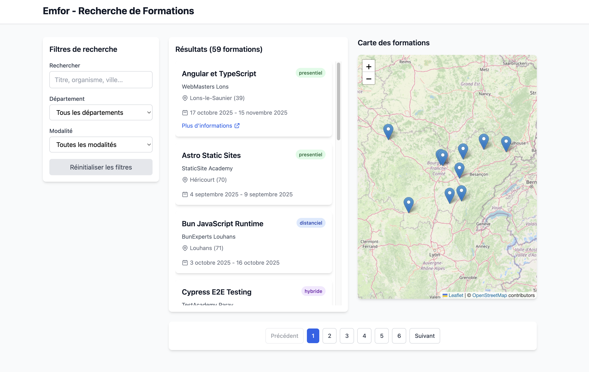

# Emfor POC - Formation Search Portal

Monorepo avec API Symfony 7 et Frontend React 18 pour recherche de formations avec carte interactive Leaflet.

> **🎯 Démarrage en une seule commande : `./start.sh`**


*Interface de recherche de formations avec carte interactive Leaflet*

## 🚀 Démarrage rapide

### Prérequis
- PHP 8.3+ avec extensions SQLite, PDO
- Node.js 20+
- Git
- Composer (installé automatiquement si absent)

### Installation et lancement automatique

```bash
# Clone le repo
git clone https://github.com/FredBourouliou/formation-search-portal-.git
cd formation-search-portal-/emfor-poc

# 🎯 Démarrage en une commande
./start.sh

# L'application est maintenant accessible sur :
# - Frontend : http://localhost:5173
# - API : http://localhost:8080
```

### Scripts de gestion

```bash
./start.sh    # 🚀 Démarre tous les services
./stop.sh     # 🛑 Arrête tous les services
./status.sh   # 📊 Vérifie l'état des services
```

## 📍 URLs d'accès

| Service | URL | Description |
|---------|-----|-------------|
| **Frontend** | http://localhost:5173 | Interface React avec carte Leaflet |
| **API REST** | http://localhost:8080 | API Symfony 7 |
| **Health Check** | http://localhost:8080/health | Status de l'API |
| **Swagger UI** | http://localhost:8080/api/docs | Documentation API |

## 🏗️ Architecture

```
emfor-poc/
├── api/                    # Backend Symfony 7 (PHP 8.3+)
│   ├── src/               # Code source
│   ├── config/            # Configuration Symfony
│   ├── migrations/        # Migrations Doctrine
│   └── tests/             # Tests PHPUnit
├── frontend/              # Frontend React 18 + Vite
│   ├── src/              # Code source React
│   └── dist/             # Build production
├── docker-compose.yml    # Orchestration Docker (optionnel)
└── Makefile             # Commandes utilitaires
```

## ✨ Fonctionnalités

- 🔍 **Recherche multicritères** : mot-clé, département, modalité
- 🗺️ **Carte interactive Leaflet** : visualisation géographique des formations
- 📄 **Pagination** : navigation fluide entre les pages
- 🔄 **Synchronisation liste ↔️ carte** : interaction bidirectionnelle
- ⚡ **Debounce** : optimisation des requêtes (400ms)
- 📱 **Responsive** : adapté mobile et desktop
- ♿ **Accessible** : ARIA labels et navigation clavier

## 💾 Base de données

**Mode Local** : SQLite (fichier `api/var/data.db`)
**Mode Docker** : MySQL 8

## 📡 API Endpoints

### Health Check
```bash
GET http://localhost:8080/health
```

### Formations
```bash
# Liste paginée avec filtres
GET http://localhost:8080/formations?page=1&limit=10&q=java&departement=21&modalite=hybride

# Détail d'une formation
GET http://localhost:8080/formations/{id}
```

### Paramètres de recherche

| Paramètre | Type | Description | Exemple |
|-----------|------|-------------|---------|
| page | int | Page courante (défaut: 1) | 2 |
| limit | int | Éléments par page (défaut: 10) | 20 |
| q | string | Recherche texte (titre, organisme, ville) | "javascript" |
| departement | string | Code département | "21" |
| modalite | string | presentiel, distanciel, hybride | "hybride" |

## 📦 Stack technique

### Backend
- PHP 8.3+ (compatible 8.4)
- Symfony 7.1
- Doctrine ORM
- SQLite (local) / MySQL 8 (Docker)
- Nelmio CORS & API Doc Bundle
- PHPUnit

### Frontend
- React 18
- Vite 5
- TypeScript
- Tailwind CSS
- Leaflet (carte interactive)
- TanStack Query (React Query)

## 🐳 Services Docker (Optionnel)

| Service | Port | Description |
|---------|------|-------------|
| db | 3306 | MySQL 8 |
| api | 9000 | PHP-FPM 8.3 + Symfony |
| web | 8080 | Caddy (reverse proxy API) |
| frontend | 5173 | Vite dev server |
| frontend_web | 8081 | Caddy (static build) |

## 🧪 Tests

```bash
# Tests backend
cd api && php bin/phpunit

# Type check frontend
cd frontend && npm run build
```

## 📝 Commandes utiles

### Backend API
```bash
cd api
php bin/console cache:clear            # Vider le cache
php bin/console doctrine:fixtures:load # Recharger les fixtures (60 formations)
php bin/phpunit                         # Lancer les tests
```

### Frontend
```bash
cd frontend
npm run build    # Build production
npm run preview  # Preview du build
```

### Mode Docker
```bash
make bootstrap   # Installation complète
make up         # Démarrer tous les services
make down       # Arrêter les services
make api-logs   # Voir les logs API
make ps         # État des conteneurs
```

## 🔧 Configuration

### Backend (.env)

**Mode Local (SQLite)**
```env
DATABASE_URL="sqlite:///%kernel.project_dir%/var/data.db"
APP_ENV=dev
CORS_ALLOW_ORIGIN='^https?://localhost:(5173|8081)$'
```

**Mode Docker (MySQL)**
```env
DATABASE_URL="mysql://root:rootpass@db:3306/emfor"
APP_ENV=dev
CORS_ALLOW_ORIGIN='^https?://localhost:(5173|8081)$'
```

### Frontend (.env)
```env
VITE_API_BASE_URL=http://localhost:8080
```

## 📊 Données de test

Le projet contient **60 formations réalistes** réparties sur les départements de Bourgogne-Franche-Comté :
- Côte-d'Or (21)
- Doubs (25)
- Jura (39)
- Nièvre (58)
- Haute-Saône (70)
- Saône-et-Loire (71)
- Yonne (89)
- Territoire de Belfort (90)

## 🔧 Résolution des problèmes

| Problème | Solution |
|----------|----------|
| Port 8080 ou 5173 déjà utilisé | Exécutez `./stop.sh` ou `lsof -ti:8080 \| xargs kill` |
| Base de données corrompue | `rm api/var/data.db` puis `./start.sh` |
| Dépendances obsolètes | `cd api && composer update` et `cd frontend && npm update` |
| Erreur de cache Symfony | `cd api && php bin/console cache:clear` |

## 🚢 Déploiement

Le projet inclut une CI/CD GitHub Actions qui :
- Teste le backend (PHPUnit)
- Build et vérifie le frontend (TypeScript)
- Vérifie le code (linting optionnel)

## 📄 Licence

MIT